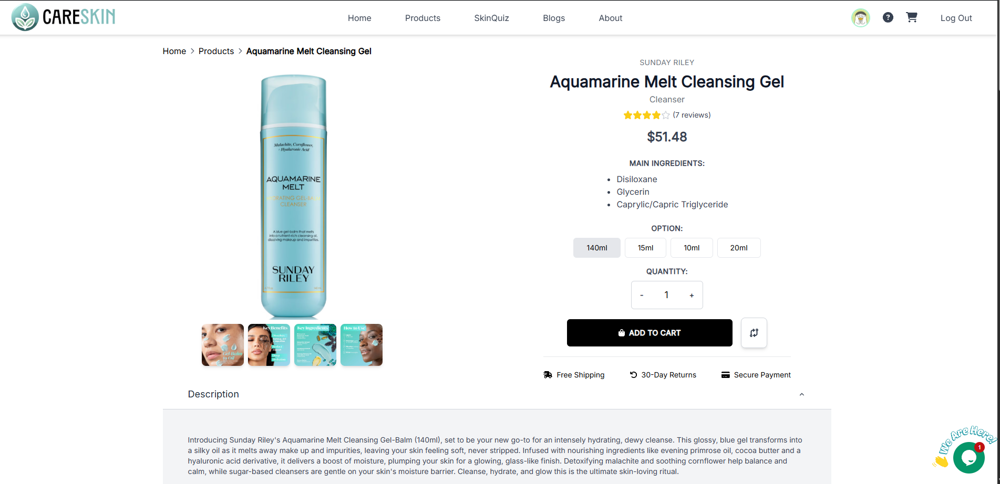

# CareSkin Shop


CareSkin Shop is a group project dedicated to developing an e-commerce website for skin care products using React on the front-end. Our goal is to provide users with a modern, responsive, and interactive platform for exploring products, chatting with our support through Tawk.to, and completing secure transactions with integrated payment gateways like Momo, VNPay, and ZaloPay.

## Project Purpose

- **Product Showcase:** Provide detailed information about skin care products, including ingredients, usage instructions, and user reviews.
- **User-Friendly Experience:** Deliver a beautiful and responsive interface that performs seamlessly across all devices.
- **Enhanced Customer Engagement:** Utilize an integrated Tawk.to chatbot to offer real-time support and assist customers during their shopping experience.
- **Secure Payments:** Facilitate smooth and secure transactions with integrated Momo, VNPay, and ZaloPay payment gateways.

## Key Features

- **Home Page:** Displays featured products, promotions, and chat support for immediate customer assistance.
- **Product Listing:** Organizes products by skin type, benefits, and brands.
- **Product Detail Page:** Provides in-depth product details, high-quality images, and customer reviews.
- **Shopping Cart:** Allows customers to add, update, or remove products before checkout.
- **Checkout Process:** Integrates secure payment methods including Momo, VNPay, and ZaloPay.
- **User Accounts:** Enables registration, login, and profile management.
- **Backend Overview:** Built on a .NET framework to handle business logic and APIs.
- **Image Storage & Database:** Uses Firebase for image storage and SQL Server hosted on Azure for an online database.



## Technologies Used

- **Front-end:** React (bootstrapped with Create React App)
- **Routing & State Management:** React Router and (optionally) Redux or Context API
- **Styling:** CSS3 (optionally using styled-components or Bootstrap)
- **Chat Integration:** Tawk.to for live chat support
- **Payment Gateways:** Integrated payment methods such as Momo, VNPay, and ZaloPay
- **Backend:** .NET (handles business logic and API endpoints)
- **Image Storage:** Firebase
- **Database:** SQL Server (linked to Azure for online hosting)
- **Containerization & Deployment:** Docker for containerization and deployment on an Ubuntu server


## Installation and Setup

### Prerequisites

- [Node.js](https://nodejs.org/en/download/) (version 12 or above) for local development
- Git for cloning the repository
- [Docker](https://docs.docker.com/get-docker/) (and optionally Docker Compose) for deployment on an Ubuntu server

### Local Development

1. **Clone the Repository:**
    ```bash
    git clone https://github.com/your-username/skin-care-shop.git
    cd skin-care-shop
    ```
2. **Install Dependencies:**
    ```bash
    npm install
    ```
3. **Start the Development Server:**
    ```bash
    npm start
    ```
   The application will run on [http://localhost:3000](http://localhost:3000).

## Docker Deployment on Ubuntu Server

This project is containerized with Docker to streamline production deployment on an Ubuntu server.

## Contact

For questions or further information, please reach out via:

- **Email:** nguyencongphi272gmail.com
- **GitHub:** MrMorbious(https://github.com/MrMorbious)